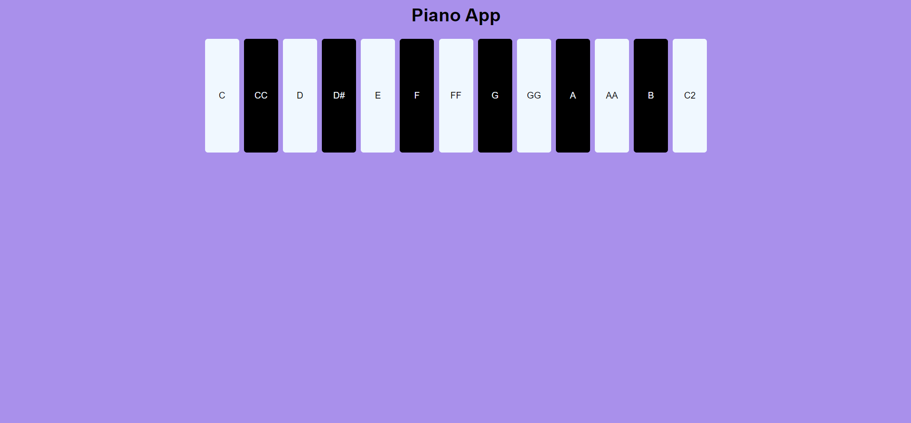

# Piano App

Una aplicación web interactiva que simula un piano digital, permitiendo a los usuarios tocar notas musicales con solo hacer clic en los botones.



## Características

- **Interfaz Interactiva:** Simula un piano con teclas blancas y negras.
- **Reproducción de Sonidos:** Reproduce el sonido correspondiente a cada tecla cuando se hace clic.
- **Diseño Atractivo:** Interfaz sencilla y agradable visualmente.

## Instalación y Uso

1. **Clonar el repositorio:**
   ```bash
   git clone https://github.com/Nathaly-Daza/PianoApp.git
   ```

2. **Navegar al directorio del proyecto:**
   ```bash
   cd PianoApp
   ```

3. **Abrir el archivo `index.html` en tu navegador:**
   ```bash
   open index.html
   ```
   O simplemente arrastra el archivo `index.html` a una ventana de tu navegador.

## Archivos del Proyecto

- `index.html`: El archivo HTML principal que estructura la aplicación.
- `style.css`: Archivo CSS que contiene los estilos de la aplicación.
- `script.js`: Archivo JavaScript que maneja la lógica de la aplicación.
- `sounds/`: Directorio que contiene los archivos de sonido para cada nota.
- `img/screenshot_main.png`: Captura de pantalla de la aplicación (debes añadir esta imagen).

## Capturas de Pantalla

### Vista Principal


## Personalización

Puedes personalizar la aplicación modificando los archivos `style.css` y `script.js` según tus necesidades. Por ejemplo, puedes cambiar los colores, estilos de botón o agregar más funcionalidades.

## Contribuciones

Las contribuciones son bienvenidas. Por favor, abre un issue para discutir cualquier cambio que te gustaría realizar.

## Vista

